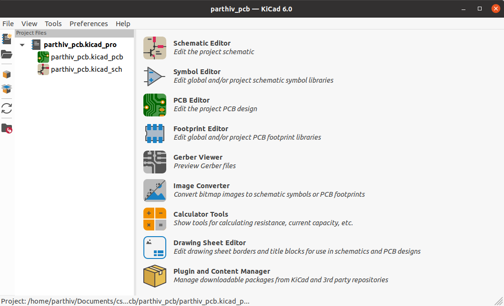

# PCB (KiCAD) Lab by Parthiv

This lab is focused on designing printed circuit boards (PCBs), which you may find useful in your final project. This is moreso a quick lesson on how to replace your bundles of wires with a more reliable board, rather than how to actually design electrical circuits on a board which is a much more involved discussion. 

## Step 0: Installation

Please follow the instructions at [https://www.kicad.org/download/](https://www.kicad.org/download/) for your OS. It is open source so it should be possible but potentially annoying to build if your OS isn't listed.

## Step 1: Creating a Project

1. Open up KiCAD (either type `kicad` in your terminal or search for it in your installed applications).
2. Go to File->New Project. Select a location where you want to create the project (you can do it in this directory) and give it a name. Ensure that the box to "Create a new folder for the project" is selected. Create the project.
3. You should see a window like this:
    

    On the left side, you can see a file called [project_name].kicad_pcb and another file called [project_name].kicad_sch. Double clicking these will open the PCB and Schematic editors respectively. 

## Step 2: Creating your Schematic

1. In the main KiCAD window, double click the .kicad_sch file to open the Schematic editor. You will see a blank schematic:

    The schematic is where we will describe what pins of what components connect to what other pins of other components. You should try to keep it relatively organized if you can!

2. Go to Place->Add Symbol (or type the keyboard shortcut A). In the search bar, search for the symbol `Raspberry_Pi_2_3`. Select it, then click OK to start placing the component. Place it somewhere in the middle of the screen.

Parthiv will do a live walkthrough and then update this!