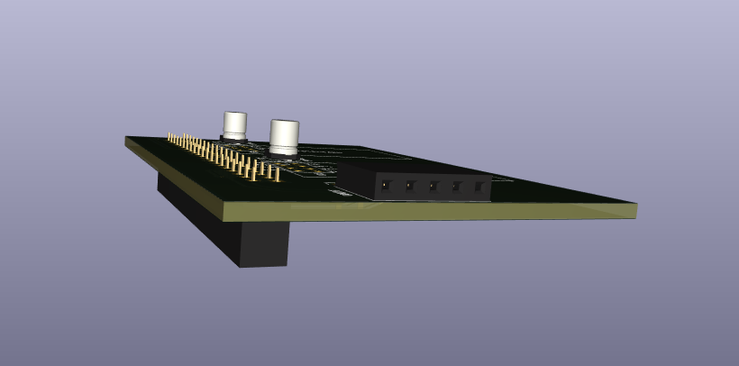

# PCB (KiCAD) Lab by Parthiv

This lab is focused on designing printed circuit boards (PCBs), which you may find useful in your final project. This is moreso a quick lesson on how to replace your bundles of wires with a more reliable board, rather than how to actually design electrical circuits on a board which is a much more involved discussion. 

Our goal is to create a board that can plug into the Raspberry Pi GPIO header and connect to the USB/UART converter and 2 NRFs. You can also optionally add other devices to the board of your choosing. My board looks something like this:

=
You can see the GPIO header on the bottom and various headers on the top to connect other devices.

A sample PCB project that contains the board above can be found in `parthiv_pcb/`. You can refer to this if you ever run into a wall for how to proceed.

## Step 0: Installation

Please follow the instructions at [https://www.kicad.org/download/](https://www.kicad.org/download/) for your OS. It is open source so it should be possible but potentially annoying to build if your OS isn't listed.

## Step 1: Creating a Project

1. Open up KiCAD (either type `kicad` in your terminal or search for it in your installed applications).
2. Go to File->New Project. Select a location where you want to create the project (you can do it in this directory) and give it a name. Ensure that the box to "Create a new folder for the project" is selected. Create the project.
3. You should see a window like this:

    

    On the left side, you can see a file called [project_name].kicad_pcb and another file called [project_name].kicad_sch. Double clicking these will open the PCB and Schematic editors respectively. 

## Step 2: Creating your Schematic

1. In the main KiCAD window, double click the .kicad_sch file to open the Schematic editor. You will see a blank schematic:

The schematic is where we will describe what pins of what components connect to what other pins of other components. You should try to keep it relatively organized if you can!

You can click and drag to move, or scroll up/down to zoom.

2. Go to Place->Add Symbol (or type the keyboard shortcut `A`). In the search bar, search for the symbol `Raspberry_Pi_2_3`. Select it, then click OK to start placing the component. Place it somewhere in the middle of the schematic by clicking. If you want to move it, you can click on it, hit `M`, and then move it around, then click again to place it. 

3. Now, we will connect the power rails of the Raspberry Pi. Hit `P` to open up the power symbol menu. Look for `GND` and hit OK to start placing the ground symbol. Put it near the bottom of the Raspberry Pi symbol. Hover over the end of one of the GND pins on the Pi, then hit `W` to start drawing a wire. Connect it to the GND symbol you just placed. Repeat this process for all the GND pins (see below).

Next, add power symbols for `+5V` and `+3V3` to the schematic, and connect those to the 5V and 3V3 pins of the Pi. Make sure you connect all pins of a given type together. We say 3V3 instead of 3.3V because in small text on a PCB, it may look like 33V. 3V3 is unambiguous.

4. Now that we've connected the power for the Pi, let's add some more components. Hit `A` again and find the `NRF24L01_Breakout` component, then place two of them. I would recommend putting them to the right of the Pi. Go ahead and connect the VCC to +3V3 and GND to GND.

5. Now, connect the NRF I/O pins to the Pi. For both NRFs, connect MOSI/MISO/SCK to the MOSI0/MISO0/SCK0 pins on the Pi. Also, connect the CSN of one to the Pi's CE0, and the CSN of the other to the Pi's CE1. Finally, connect the CE of each to two free GPIO pins (I chose 5 and 6). You can optionally also connect the IRQ pins to GPIO pins so you could have interrupt functionality, just make sure that each IRQ goes to a different GPIO.

6. The next step is to add a 10 uF coupling capacitor to each of the NRF power input pins to help smooth out the power supply to the NRF. Hit `A` and look for the `C_Polarized` part, and place one by each NRF. Connect the positive end of each to the NRF VCC, and the negative end to ground. Click on each capacitor and hit `E` to edit the properties. Set the value of each capacitor to `10 uF`. See the screenshot at the end of this section for what it should look like when you're done. 

7. Now, let's create a connector for our USB/UART chip so we can plug it directly into the PCB. We'll want to create a symbol to represent the logical pins that 

### Completed Schematic

When you're done, your schematic should look something like this:

### Schematic Editor Keyboard Shortcuts

* `A`: add symbol
* `P`: add power symbol
* `Esc`: go to regular mouse (select) mode
* `M`: move (after selecting a symbol)
* `R`: rotate (after selecting a symbol)
* `E`: edit symbol properties (after selecting a symbol)
* `Q`: place no-connect symbol (should be in select mode first)
* `W`: draw wire (should be in select mode first)

### Schematic Editor Tools

* Tools->Symbol Editor: create new symbols
* Tools->Annotate Schematic: 

## Step 2: Create PCB

[https://github.com/Bouni/kicad-jlcpcb-tools](https://github.com/Bouni/kicad-jlcpcb-tools)